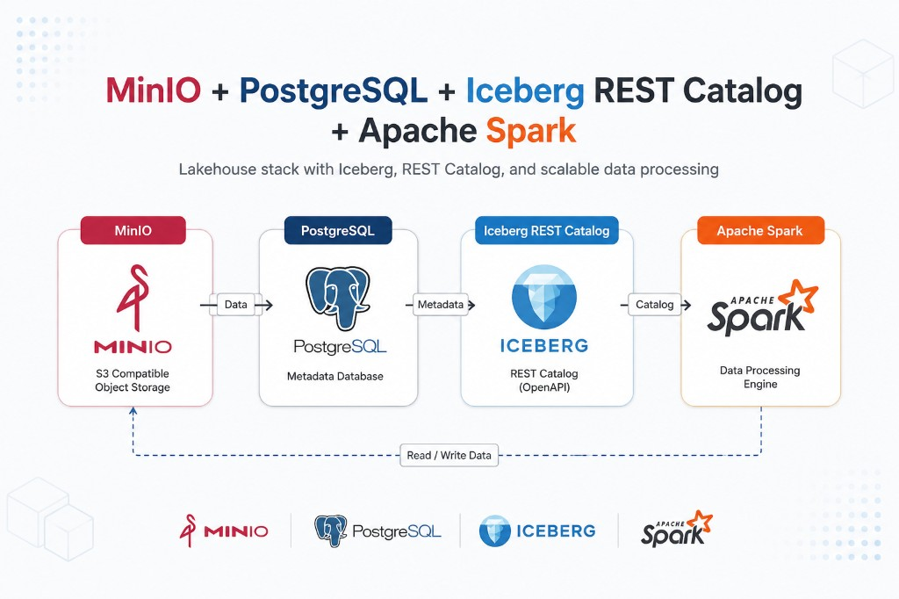

# Workshop Lakehouse



Stack **MinIO + PostgreSQL + Iceberg REST Catalog + Apache Spark**, basado en las imágenes oficiales de la comunidad Iceberg (`tabulario/iceberg-rest` y `tabulario/spark-iceberg`).

## Arquitectura

| Componente | Rol |
|---|---|
| **MinIO** | Almacenamiento de objetos compatible con S3 |
| **PostgreSQL** | Base de metadatos del catálogo |
| **Iceberg REST Catalog** | Catálogo REST (OpenAPI) |
| **Apache Spark** | Motor de procesamiento (lectura/escritura sobre MinIO) |

## Requisitos

- Docker Engine 24+ y Docker Compose v2
- Al menos **8 GB de RAM** (recomendado **16 GB** si corres Jupyter + Spark juntos)
- Puertos libres: `9000`, `9001`, `8181`, `8888`, `8080`

## Despliegue rápido (un solo servidor)

### 1. Clonar el repositorio

```bash
git clone <url-del-repo> Workshop_Lakehouse
cd Workshop_Lakehouse
```

### 2. Descargar imágenes y levantar el stack

```bash
docker compose pull
docker compose up -d
docker compose ps
```

Todos los servicios deben aparecer como `Up` / `healthy`.

### 3. Verificar servicios

```bash
# Catálogo Iceberg REST
curl http://localhost:8181/v1/config

# Consola MinIO
# http://localhost:9001  →  usuario: admin  /  password: password12345
# Debe existir el bucket `warehouse`
```

| Servicio | URL |
|---|---|
| Consola MinIO | http://localhost:9001 |
| Iceberg REST Catalog | http://localhost:8181 |
| Jupyter Notebook | http://localhost:8888 |
| Spark UI | http://localhost:8080 |

### 4. Ejecutar la demo

**Opción A — Terminal (recomendada)**

```bash
# Ingesta CSV → tabla Iceberg
docker exec -it spark-iceberg spark-submit /home/iceberg/jobs/load_and_query.py

# Consultas interactivas (snapshots, time travel, schema evolution)
docker exec -it spark-iceberg spark-sql
```

Dentro de `spark-sql`, ejecuta los bloques de `jobs/demo_en_vivo.sql` uno a uno.

**Opción B — Jupyter**

1. Abre http://localhost:8888
2. Abre `notebooks/demo_en_vivo.ipynb`
3. Ejecuta las celdas en orden (Shift+Enter)

### 5. Detener o reiniciar

```bash
# Detener (conserva datos)
docker compose stop

# Reiniciar
docker compose up -d

# Borrar todo (incluye volúmenes de MinIO y PostgreSQL)
docker compose down -v
```

## Despliegue en dos servidores (storage + compute)

Si separas almacenamiento y cómputo:

| Servidor | Compose | Servicios |
|---|---|---|
| **VPS1 — Storage** | `docker-compose-vps1-storage.yml` | MinIO, PostgreSQL, Iceberg REST |
| **VPS2 — Compute** | `docker-compose-vps2-compute.yml` | Spark + Jupyter |

1. Copia el proyecto a ambos servidores.
2. En VPS1, abre el firewall solo hacia la IP privada de VPS2 en los puertos `9000` y `8181`.
3. En VPS2, crea un archivo `.env`:

```bash
VPS1_PRIVATE_IP=<ip-privada-de-vps1>
```

4. Asegúrate de que `spark-defaults.conf` use esa IP (sin placeholders `${...}`).
5. Levanta primero VPS1 y luego VPS2:

```bash
# En VPS1
docker compose -f docker-compose-vps1-storage.yml up -d

# En VPS2
docker compose -f docker-compose-vps2-compute.yml up -d
```

Guía detallada con firewall y troubleshooting: [`PASO_A_PASO_VPS_UBUNTU.md`](PASO_A_PASO_VPS_UBUNTU.md).

## BI opcional (Superset)

Para conectar Superset vía JDBC, inicia el Thrift Server en Spark:

```bash
docker exec -it spark-iceberg /opt/spark/sbin/start-thriftserver.sh \
  --master local[*] --hiveconf hive.server2.thrift.port=10000
```

En Superset: **Data → Databases → + Database**, motor Apache Hive, URI:

```
hive://spark-iceberg:10000/demo
```

## Credenciales de demo

> Solo para entorno de laboratorio. No uses estas credenciales en producción.

| Servicio | Usuario | Password |
|---|---|---|
| MinIO | `admin` | `password12345` |
| PostgreSQL | `iceberg` | `iceberg` |

## Problemas frecuentes

| Síntoma | Solución |
|---|---|
| MinIO aparece `unhealthy` | El healthcheck usa `mc ready local` (no `curl`) |
| Bucket `warehouse` no existe | `docker exec -it minio mc alias set local http://localhost:9000 admin password12345 && docker exec -it minio mc mb -p local/warehouse` |
| `NoClassDefFoundError: StorageUtils` | Recrea el contenedor; el compose incluye `JAVA_TOOL_OPTIONS` para Java 17 |
| Jupyter: `Another SparkContext` | Kernel → Restart and Clear Outputs; no re-ejecutes la celda de creación del contexto |
| En 2 VPS, Spark no conecta al catálogo | Usa la IP privada (no la pública) en `.env` y `spark-defaults.conf`; revisa el firewall |
